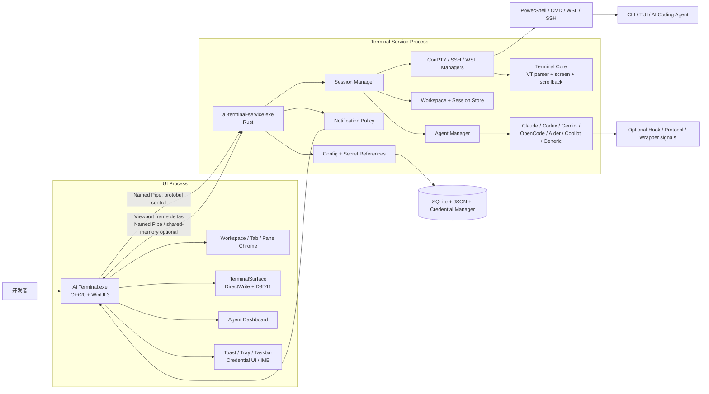
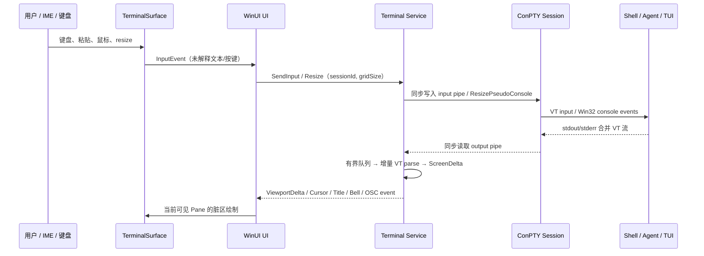
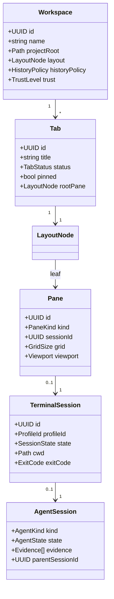
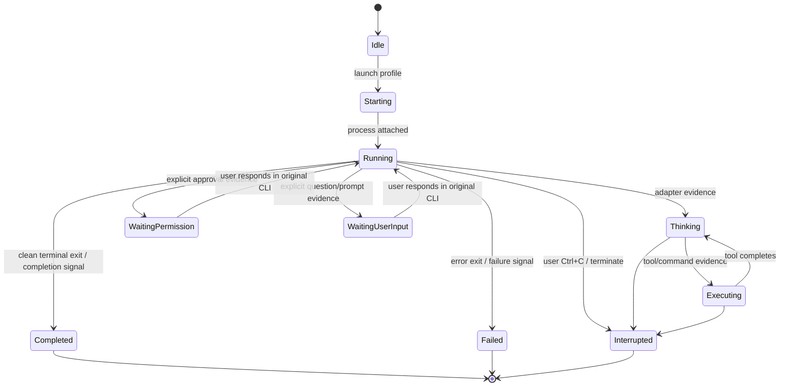

# AI Terminal Architecture Document

**版本：** 0.1（架构冻结稿）  
**作者：** Manus AI  
**目标平台：** Windows 11 优先，Windows 10 1809+ 为兼容下限。  
**产品定位：** 面向 Claude Code、Codex、Gemini CLI、OpenCode、Aider、Copilot CLI 及标准开发工具链的 **Terminal First、Agent-aware** Windows 终端。

## 1. 架构目标与非目标

AI Terminal 的首要目标不是替代 VS Code 或重建完整 IDE，而是提供对标准交互式 CLI 可靠、低延迟且长期可维护的 Windows Terminal，并将 AI Coding 会话的状态、权限暂停、项目上下文与并行任务作为**可选控制平面**提供。底层 VT/PTY 数据面永远独立于 Agent 功能；任何 Agent adapter 的故障均不能妨碍 PowerShell、CMD、WSL、SSH、vim、top、python REPL 或其他 TUI 的正常工作。

| 架构目标 | 可验证结果 | 不做的事 |
| --- | --- | --- |
| 可靠终端 | 支持 ConPTY、VT、alternate screen、鼠标、调整尺寸、Unicode/CJK/Emoji、剪贴板和退出码。 | 不以 `cmd.exe + stdout + HTML div` 冒充 terminal emulator。 |
| 高吞吐 | 100 MB 输出不冻结 UI；输出读取、解析、渲染和 React/WinUI 壳层不互相阻塞。 | 不将每个字符或每行输出作为 UI 状态事件。 |
| AI 任务可见 | 使用 Running、Thinking、Executing、WaitingPermission、WaitingUserInput、Completed、Failed、Interrupted 等统一状态。 | 不从未经验证的彩色文本“猜测”并自动批准危险操作。 |
| Windows 原生体验 | WinUI/Fluent、Mica、Notification、Tray、Taskbar、Credential Manager、IME 与可访问性。 | 不为跨平台而牺牲 Windows 管理、输入与安全体验。 |
| 可演进 | 核心、会话、插件、adapter、通知通过版本化协议隔离。 | 不把全部实现集中在单个 UI 进程或 `App.tsx`。 |

## 2. 技术选型

### 2.1 方案比较

| 方案 | 终端热路径与渲染 | Windows API / ConPTY | UI 与系统整合 | 内存与启动风险 | 跨平台潜力 | 维护判断 |
| --- | --- | --- | --- | --- | --- | --- |
| A. Rust + Tauri + React/TS | xterm.js/WebGL 可在 MVP 使用，但 WebView 主线程和 JS GC 不适合正式版按字符热路径。 | Rust 可以直接调用 ConPTY；需严控 IPC 频率。 | Tauri 可用 WebView2，快速实现设置与面板。 | 优于 Electron，但仍有 WebView 固定成本。 | 高。 | 适合作为交互原型与开发工具，不作为生产终端 renderer 的首选。 |
| B. Rust + 原生 Windows UI | Rust 可实现 parser/PTY；原生 UI 与 GPU 文字栈需自行承担。 | `windows` crate 可直接覆盖 API。 | WinUI 3 在 Rust 中缺少成熟、低风险的生产工程路径。 | 潜力高，开发风险高。 | 中。 | 适合核心/服务，但不单独承担第一版 Windows UI。 |
| C. C++20 + WinUI 3 | 可用 DirectWrite/Direct2D/D3D11/12 实现真正原生渲染。 | 与 ConPTY、COM、Credential Manager、Toast、IME 集成最直接。 | WinUI 3 是微软推荐的新 Windows desktop UI 框架。[1] | 启动、内存可控，C++ 构建复杂。 | 低。 | 适合 Windows 原生 Shell 和 renderer。 |
| D. Electron + React | 成熟 xterm.js 与插件生态，但运行时常驻 Chromium/Node。 | 可调用 node-pty，安全边界较宽。 | UI 迭代快。 | 包体、冷启动与内存目标风险最高。 | 高。 | 不符合“性能优先且 Windows native”的产品原则。 |
| E. 分层混合：WinUI 3/C++ Shell + Rust Terminal Service | C++ 负责原生渲染；Rust service 负责 PTY、VT core、会话、agent。 | C++/Rust 都可精确使用 Windows API，服务故障与 UI 隔离。 | 兼得 WinUI 系统体验与 Rust 并发/安全性。 | 初期工程复杂；长期可控。 | 中：Rust service 可复用。 | **推荐。** |

### 2.2 最终选择

**选择方案 E：`C++20 + WinUI 3` 原生界面与 DirectWrite 渲染器，配合独立 `Rust Terminal Service`。** 这不是为形式混合语言，而是把两个复杂域放在更合适的故障与维护边界中：Windows 原生窗口、IME、拖拽、无障碍、Tray 和 Toast 由 C++/WinUI 3 管理；ConPTY、异步 I/O、VT 状态、会话持久化、Agent adapter 和策略引擎由 Rust service 管理。

WinUI 3 是微软推荐的新 Windows desktop framework，并提供 Fluent 控件、高 DPI、键鼠输入和现代 Windows API 的整合能力。[1] Tauri 的 Rust 后端/WebView 前端架构在设置与原型场景中具有吸引力，但其 UI 仍在系统 WebView 内渲染。[2] 因此它被保留为**内部 UI 验证工具链**，而非产品终端屏幕的正式热路径。Electron/Hyper 和 Tabby 已证明 Web 技术可以实现可用终端，但其扩展性并不抵消高吞吐、低内存和原生系统整合的长期代价。[3] [4]

### 2.3 终端核心取舍

| 候选 | 采用结论 | 原因与边界 |
| --- | --- | --- |
| Windows Terminal 内部组件 | **借鉴，不嵌入。** | 项目具有 VT、DirectWrite 和文本缓冲经验，但没有面向第三方的稳定嵌入 SDK；只作为行为、测试和模块边界参考。[5] |
| `alacritty_terminal` | **技术验证候选。** | Rust 终端逻辑独立为 crate，Alacritty 支持 Windows，且仓库存在 Apache-2.0/MIT 许可路径。[6] 只将其作为可替换 parser/screen model 候选；锁版本、做 API/许可证审查后再纳入。 |
| WezTerm core | **借鉴 session/domain 模型。** | 其 domain 概念很适合后续可恢复/远程会话，但直接嵌入会带入过多应用层。[7] |
| libghostty | **持续观察。** | 核心/GUI 分层极具启发性，但官方说明尚未将其作为稳定独立 API 发布。[8] |
| xterm.js + WebGL | **仅作原型与回退实验。** | 功能和 addon 生态完备，含 Search、Unicode、WebLinks、Image 等；但它是浏览器前端组件。[9] 不作为正式版 renderer。 |

## 3. 总体组件架构



这个架构的关键是：UI 只接收**可见 viewport 的帧增量**和控制状态，不持有完整 scrollback，不读取子进程 stdout，也不为每条输出创建 UI 对象。Service 持有所有 session 资源，并可在 UI 崩溃重启后按 workspace/session metadata 恢复连接；但它不会虚假承诺能重新附着到任意已失去 PTY 的传统进程。

## 4. Terminal 数据面

### 4.1 ConPTY 适配层

ConPTY 在 `CreatePseudoConsole` 时接受输入、输出管道与字符格尺寸；宿主负责呈现输出、采集输入并序列化到输入流。[10] 输入与输出目前限制为同步 I/O，这决定了 service 必须用专用阻塞 reader/writer 线程将数据桥接至内部有界队列，而不是试图在 UI 线程做 overlapped I/O。



每个 `PtySession` 必须具有独立 input writer、output reader、process watcher、resize coalescer、parser worker 和关闭控制器。输入的顺序性按 session 保证；输出队列有上限，超过阈值时优先合并 UI 帧而不是丢失原始 VT 字节。极端持续输出会使 scrollback 从内存 ring buffer 中淘汰最旧行，并可按用户的历史策略选择是否落盘。

### 4.2 关闭状态机

`ClosePseudoConsole` 会向仍连接的 client 发送 `CTRL_CLOSE_EVENT`；在 Windows 11 24H2 之前，如果未预先关闭或排空 output pipe，调用可无限等待，因此关闭不能与 output reader 在同一线程互相等待。[11]

```mermaid
stateDiagram-v2
    [*] --> Creating
    Creating --> Running: PTY + child process created
    Creating --> Failed: create/launch error
    Running --> Resizing: grid size changed
    Resizing --> Running: ResizePseudoConsole completed
    Running --> Closing: user closes pane / process exits
    Running --> Orphaned: service fault or transport disconnected
    Closing --> Draining: input closed; output still read
    Draining --> Closed: pipe EOF + process exit observed
    Closing --> Closed: forced timeout / service shutdown
    Orphaned --> Recoverable: service session journal intact
    Orphaned --> Lost: PTY ownership unavailable
    Recoverable --> Running: UI reattaches to service session
    Failed --> [*]
    Closed --> [*]
    Lost --> [*]
```



在 `Closing` 后，service 停止新输入、关闭 input、继续排空 output、由非 reader 线程调用 `ClosePseudoConsole`、等待或记录 child exit code，并对 UI 广播 `SessionClosed`。如果 service 和 PTY 一起消失，传统 shell/CLI 会话通常**不可恢复**；只能恢复 Tab、Pane、cwd、Profile、启动命令与工作区结构。未来的远程/持久会话通过独立 mux/server 支持重新附着。

### 4.3 VT、Unicode 与兼容性

Terminal Core 按 xterm/VT 语义维护 normal/alternate buffer、cursor、styles、scrollback、hyperlink IDs、title 与 modes。输入端支持按终端模式编码键盘、鼠标、bracketed paste 和 focus event；渲染端同时处理 East Asian width、grapheme cluster、combining marks、Emoji ZWJ 与 fallback font。`TerminalSurface` 用 DirectWrite 做字体 fallback 和 shaping，但格宽决定仍来自 Terminal Core，以避免视觉长度与 cursor position 脱节。

OSC、DCS、APC 等控制序列被分级：安全且可呈现的 title、OSC 8 hyperlink、OSC 9 progress 等进入受限事件通道；剪贴板写入、shell integration、file/url opener、图片协议等需要显式 feature policy。任何不认识或超过长度限制的控制 payload 均被丢弃/诊断，绝不进入 HTML、XAML 或 shell。

## 5. 渲染、性能与资源预算

| 层 | 实现 | 关键策略 |
| --- | --- | --- |
| PTY 读取 | 每 session 的同步 reader thread + bounded queue | 读取不依赖 UI；防止慢渲染让 pipe 塞满。 |
| Parser | 增量 VT parser + screen delta | 每批 bytes 只改变 dirty rows/cells；不复制全屏 buffer。 |
| Scrollback | 内存 ring buffer；可选压缩/加密持久化 | 默认限制行数和字节数；历史模式决定是否落盘。 |
| IPC | Length-prefixed protobuf，控制与帧通道分离 | 合并连续 `FrameDelta`；每 Pane 只订阅可见 viewport。 |
| Renderer | D3D11/D2D/DirectWrite glyph atlas + dirty rect | 按行/单元格 patch；字体变化才重建 atlas；DPI 变更触发完整 layout。 |
| Chrome UI | WinUI 3 视图模型 | Tab/Pane/状态事件低频更新；不会观察 PTY bytes。 |

目标指标不是以不可信的实验室数字承诺，而是作为 CI benchmark 门槛：空闲冷启动 P50 小于 1 秒；常规单窗口无长期历史时进程常驻内存目标低于 150 MB；100 MB 输出中输入延迟、Tab 切换和滚动均不能出现持续可感知卡顿。Warp 的工程经验也将 PTY 读取、ANSI 解析、滚动和 GPU 字形绘制列为高吞吐终端的主要瓶颈。[12]

## 6. Session、Tab、Pane 与 Workspace



`LayoutNode` 为二叉 split tree，节点记录 `axis`、`ratio`、左右子节点或 leaf `paneId`；这可支持任意嵌套的垂直/水平分屏、拖拽调节、zoom、swap、duplicate 与确定性恢复。Tab 和 Pane 是 UI 组织实体，TerminalSession 是 service 资源实体；一个 Tab 可包含多个 Pane，每个 Pane 通常附着一个 Session。MVP 不允许一个 Session 同时被多个 Pane 主动输入，避免焦点和尺寸冲突；未来 mux/readonly mirror 另行设计。

Workspace 借鉴“临时/保存”两个明确状态，而不隐式把每个窗口永久保存。[13] 默认数据策略为 `MetadataOnly`：保存布局、cwd、Profile、Agent 类型、时长、退出码和项目路径，但不保存终端全文。`FullEncrypted` 模式才保存压缩加密的 scrollback/command block，且在设置中显示风险说明与清除按钮。

## 7. Agent Adapter 与状态模型

### 7.1 统一状态



`AgentAdapter` 是插件式的**只读观察层**，不会擅自执行、批准或重写 Agent 命令。其证据来源按照可靠性排序：明确的本地 hook/机器可读协议 > 专用 wrapper 的结构化 side channel > 进程生命周期/退出码 > 有版本控制的输出 pattern。低可信度 pattern 只能显示 `Running (unclassified)` 或 `Possible input requested`，不可驱动自动批准/通知升级。

| Adapter | MVP 获取方式 | 可展示内容 | 禁止行为 |
| --- | --- | --- | --- |
| Generic Shell | child process、exit code、cwd、terminal title。 | Running/Exited、cwd、耗时、exit code。 | 不解析任意文本为“权限请求”。 |
| Claude Code | 可选 Hook/状态行/显式 wrapper；尊重 CLI 权限设置。 | 正在运行、等待批准、cwd、命令/文件摘要（有协议时）。 | 不写入 `.claude` 或更改权限，除非用户明确确认安装 integration。 |
| Codex CLI | process/sandbox 元数据与显式状态协议（如可用）。 | sandbox mode、approval wait、task duration。 | 不将终端检测等同于批准。 |
| Gemini CLI / OpenCode / Copilot | 读取其官方可用 configuration/hook/agent profile 信息。 | tool permission、subagent、task/plan 状态。 | 不读取或保存 token/secret。 |
| Aider | Git 只读状态、进程、可选脚本化事件。 | branch/diff summary、会话时长。 | 不自动 commit/revert。 |

Claude Code、Codex、Gemini CLI 和 OpenCode 都将权限/沙箱/项目边界作为核心语义。[14] [15] [16] [17] 这些机制的共同设计要求是：AI Terminal 显示 `WaitingPermission` 后，只允许用户通过**原 CLI 交互**或将来官方 adapter API 回应；产品不得实现“全局一键批准所有 Agent”。

## 8. 进程模型与 IPC

UI 与 Terminal Service 使用同一登录用户下、ACL 限制的 Windows Named Pipe。控制消息和帧消息逻辑分离；每条 Envelope 均含 protocol version、request ID、session/workspace ID 与时间戳。服务启动采用 Windows Job Object 管理其创建的 child process；服务 UI connection 断开时默认继续运行 session，直至用户关闭或策略超时。

| IPC 域 | 请求示例 | 响应/事件示例 | 约束 |
| --- | --- | --- | --- |
| 生命周期 | `CreateSession`、`CloseSession`、`RestartSession` | `SessionCreated`、`SessionExited` | Idempotency key；绝不把密钥放在日志。 |
| 终端输入 | `SendInput`、`Resize`、`SetFocus` | `InputRejected`、`ResizeApplied` | 保序、带 session ACL、输入不经 plugin 转发。 |
| 屏幕 | `SubscribeViewport`、`ScrollTo`、`Search` | `FrameDelta`、`ScrollbackChunk` | 仅推送订阅可见区域；有背压。 |
| 工作区 | `SaveWorkspace`、`OpenWorkspace` | `WorkspaceSnapshot` | 使用 schema version 和原子写入。 |
| Agent | `QueryAgentState`、`InstallIntegration` | `AgentStateChanged`、`ApprovalHint` | Integration 安装需 UI 明确确认。 |
| 平台 | `RequestNotification` | `NotificationIntent` | service 只提出 intent，UI 依据用户设置显示 Toast。 |

Service 崩溃时 UI 显示 reconnect banner，并提供重启 service、导出诊断与关闭窗口。UI 崩溃时 service 保留 session 和 bounded scrollback，直到短期重连窗结束；若 Service 仍存活，新 UI 可重新订阅 Session。独立 service 是为了隔离故障，而不是承诺所有 ConPTY child 在系统崩溃后可重新附着。

## 9. 配置、秘密与存储

```text
%APPDATA%\AITerminal\
├── config.json                 # 外观、启动、隐私、通知总配置
├── profiles.json               # shell / agent / SSH profile（无 secret）
├── keybindings.json            # 可覆盖的命令绑定
├── state.db                    # SQLite: metadata、layout、history index、migrations
├── themes\                     # JSON theme files
├── workspaces\                 # 可移植 workspace JSON snapshots
├── plugins\                    # manifest 与隔离的 plugin bundles
├── logs\                       # 已脱敏的诊断日志
└── cache\                      # 可丢弃的 glyph/search/index cache
```

JSON 适合人工编辑、diff 和导入导出；SQLite 适合原子化的 Session/Workspace 元数据、索引、migrations 与全文搜索索引。密码、SSH private-key passphrase、OAuth refresh token、agent token 仅存 Windows Credential Manager/DPAPI 保护区；SQLite、JSON、日志和 crash dump 永不保存明文秘密。SSH profile 引用 `credentialRef`，不引用原始密码。

## 10. 插件安全模型

第一版只实现内置、签名/清单校验的 adapter；第三方插件为后续阶段。未来插件运行在独立 Plugin Host（优先 WASM component + capability manifest），其 API 划分为 `AgentAdapter`、`StatusProvider`、`CommandProvider`、`NotificationProvider` 和受限 `TerminalDecorationProvider`。默认无 filesystem、network、secret、process spawn、PTY input 与 OS clipboard 权限；所有额外 capability 需要用户授权并可在 Settings 撤销。

Hyper 的组件/Node plugin 机制提供了丰富扩展性，却说明插件不应任意接触终端 UI 与本机进程。[3] Tabby 的模块化 Profile/SSH/terminal packages值得借鉴，但 AI Terminal 必须用更严格的能力模型隔离高权限 terminal host。[4]

## 11. 安全设计

| 威胁 | 防护策略 |
| --- | --- |
| Command injection | UI 快捷启动使用参数数组而非 shell 拼接；命令预览区显示实际 executable、args、cwd；Workspace 变量替换严格白名单。 |
| 恶意 VT/OSC 输出 | Parser 限制 payload 长度、协议白名单与速率；不将终端文本注入 XAML/HTML；外部 opener 明示真实 URI。 |
| Clipboard attack | 默认开启大粘贴/多行粘贴告警；显示控制字符；禁止未经允许的 OSC 52 写剪贴板。Windows Terminal 也默认提供大粘贴和多行粘贴警告。[18] |
| URL / 视觉欺骗 | OSC 8 与自动链接显示真实 host/scheme；需要 Ctrl+Click；对 `file:`、自定义 scheme、punycode/混合文字域进行警告。 |
| Agent 越权 | `WaitingPermission` 是显示层状态而非授权 API；始终尊重原 CLI sandbox/permission policy。 |
| Workspace config injection | 打开陌生 workspace 时进入 Untrusted，禁用 autostart command、hooks、plugin；需显式 Trust。 |
| SSH 凭据泄漏 | Credential Manager 引用、最小日志、不会把私钥/密码回显到 command history；每 host 的 host-key 变更需确认。 |
| 日志与历史泄密 | 默认 MetadataOnly；Full history 必须加密、限定保留期、可按 workspace/session 清除。 |

## 12. 项目结构

```text
ai-terminal/
├── apps/
│   ├── windows-ui/             # C++20 / WinUI 3: shell, panes, renderer, toast, tray
│   ├── terminal-service/       # Rust binary: ConPTY, session, parser, agent, IPC
│   └── design-prototype/       # 可运行 UI 验证原型；不承担生产 renderer
├── crates/
│   ├── terminal-protocol/      # protobuf schema + generated Rust/C++ bindings
│   ├── terminal-core/          # parser wrapper, grid, scrollback, VT security policy
│   ├── pty-win/                # ConPTY, Job Object, process tree, WSL helpers
│   ├── session/                # lifecycle, recovery journal, workspace runtime
│   ├── workspace/              # schema, migration, validation, trust policy
│   ├── agent/                  # normalized states, adapter traits, evidence model
│   ├── git-status/             # read-only Git status worker
│   ├── config/                 # JSON/SQLite/DPAPI access
│   └── plugin-host/            # later isolated plugin runner
├── plugins/
│   ├── builtin-claude/
│   ├── builtin-codex/
│   ├── builtin-gemini/
│   ├── builtin-opencode/
│   └── builtin-generic/
├── docs/
│   ├── ARCHITECTURE.md
│   ├── RESEARCH.md
│   ├── UI_UX_SPEC.md
│   ├── SECURITY.md
│   └── OPEN_SOURCE_NOTICES.md
├── tests/
│   ├── terminal-core/
│   ├── conpty-integration/
│   ├── ui-e2e/
│   └── stress/
├── proto/
│   └── terminal.proto
├── scripts/
│   ├── bootstrap.ps1
│   └── test-stress.ps1
└── README.md
```

## 13. 质量与测试策略

| 测试层 | 覆盖对象 | 代表性场景 |
| --- | --- | --- |
| Unit | parser、cell grid、Unicode width、OSC policy、config migration、layout tree、agent evidence。 | SGR、CSI、alternate buffer、OSC 8、损坏 UTF-8、深层 split、状态去抖。 |
| Integration | ConPTY、PowerShell、CMD、WSL、SSH、resize、clipboard policy。 | `Get-ChildItem`、`dir`、`wsl ls -la`、vim、python、ssh、Ctrl+C、close drain。 |
| Renderer | glyph fallback、CJK、Emoji、DPI、selection、cursor、dirty rect。 | Cascadia/JetBrains/Nerd Font；缩放与窗口拖拽。 |
| Stress | reader/parser/frame backpressure、scrollback ring、跨 Tab 隔离。 | 100 MB stdout、连续 resize、10 个 session 并行、慢 UI consumer。 |
| E2E | workspace restore、Command Palette、tabs/panes、adapter notifications。 | `Claude | Codex` 双 Pane、等待授权、高亮与 Toast（mock adapter）。 |
| Security | workspace trust、OSC fuzz、URL/clipboard、secret redaction、plugin capability。 | 畸形控制序列、超长 OSC、恶意 JSON、错误 SSH host key。 |

## 14. Roadmap 与风险登记

| 阶段 | 交付重点 | 明确不承诺 |
| --- | --- | --- |
| Phase 0：技术验证 | ConPTY → parser → DirectWrite Surface；PowerShell/CMD/WSL 手工回归。 | 不做 Agent 面板或插件。 |
| Phase 1：MVP Terminal | Tab、任意嵌套 Pane、Profile、主题、GUI Settings、Command Palette、Workspace snapshot。 | 不做完整 Git Client、远程复连、第三方插件。 |
| Phase 2：Developer Terminal | Project、SSH Manager、read-only Git、Session metadata、Tray/Toast。 | 不在 SSH 内注入 shell integration。 |
| Phase 3：AI Coding Terminal | 内置 Agent adapters、Dashboard、状态通知、权限等待可见性。 | 不通用自动批准；不上传 terminal history。 |
| Phase 4：Advanced | 签名插件、Remote Agent、Web read-only dashboard、MCP、外部通知。 | 不把产品扩展成 IDE。 |

最大的风险是 DirectWrite terminal renderer 与 VT 兼容性的工程量、Windows 版本差异、AI CLI 缺乏稳定状态协议、以及第三方插件安全。对应策略是先以可测的 PTY/Parser/FrameDelta 验证链路冻结数据模型；Agent 功能以 Generic adapter 兜底；插件和远程能力只在 capability/security model 成熟后推出。

## 15. 开源复用与许可证初始清单

| 项目 | 许可证/状态 | 拟用部分 | 使用前动作 |
| --- | --- | --- | --- |
| Alacritty | Apache-2.0 / MIT 路径，需最终依赖核查。[6] | Terminal parser/screen model 的评估候选。 | 锁定 crate 版本、生成 SBOM、保留 notices、审查 transitive licenses。 |
| Windows Terminal | MIT。[5] | 行为、测试案例、架构借鉴。 | 默认不复制代码；若取样，逐文件保留许可与 attribution。 |
| xterm.js | MIT。[9] | 仅 design prototype / renderer 对照实验。 | 不作为 production renderer；保留 NOTICE。 |
| Tabby | MIT。[4] | 仅借鉴 Profile/插件交互。 | 不复制，除非逐模块许可审计。 |
| WezTerm | MIT（须在锁版本时再审计）。 | domain/session 设计借鉴。 | 不直接嵌入。 |

## 16. References

[1]: https://learn.microsoft.com/en-us/windows/apps/winui/winui3/ "WinUI 3"
[2]: https://v2.tauri.app/concept/architecture/ "Tauri Architecture"
[3]: https://hyper.is/ "Hyper"
[4]: https://github.com/eugeny/tabby "Tabby repository"
[5]: https://github.com/microsoft/terminal "microsoft/terminal"
[6]: https://github.com/alacritty/alacritty "Alacritty repository"
[7]: https://wezterm.org/multiplexing.html "WezTerm Multiplexing"
[8]: https://ghostty.org/docs/about "About Ghostty"
[9]: https://github.com/xtermjs/xterm.js/ "xterm.js repository"
[10]: https://learn.microsoft.com/en-us/windows/console/createpseudoconsole "CreatePseudoConsole"
[11]: https://learn.microsoft.com/en-us/windows/console/closepseudoconsole "ClosePseudoConsole"
[12]: https://www.warp.dev/blog/how-warp-works "How Warp Works"
[13]: https://docs.waveterm.dev/workspaces "Wave Terminal Workspaces"
[14]: https://code.claude.com/docs/en/permissions "Claude Code permissions"
[15]: https://learn.chatgpt.com/docs/sandboxing "Codex sandboxing"
[16]: https://geminicli.com/docs/reference/tools/ "Gemini CLI tools reference"
[17]: https://opencode.ai/docs/agents/ "OpenCode agents"
[18]: https://learn.microsoft.com/en-us/windows/terminal/customize-settings/interaction "Windows Terminal interaction settings"
