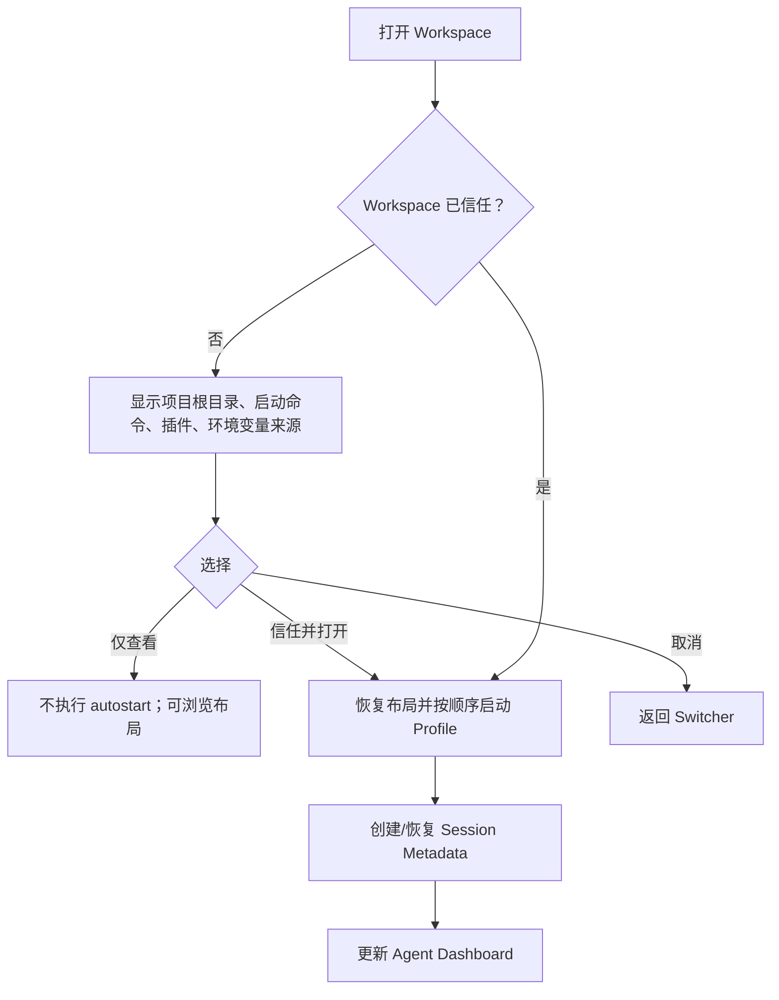

# AI Terminal UI/UX Specification

**版本：** 0.1  
**视觉方向：** Windows 11 Fluent、深色优先、Mica 可选、Terminal First。  
**设计原则：** 高信息密度不等于高噪声；Agent 状态应一眼可见，但永远不压过终端本身。

## 1. 视觉系统

AI Terminal 使用冷静的石墨黑和蓝色焦点作为默认工作环境，将绿色、琥珀色、红色限定为运行/等待/失败的语义信号，而不是装饰色。窗口 Chrome 采用窄高度，Tab 与 Pane header 具有足够的命中区域，连续工作八小时仍应保持视觉稳定。Mica/Acrylic 仅应用于非滚动的 shell 区域；TerminalSurface 和滚动正文保持实色，确保文本对比与 GPU 合成成本可控。

| Token | 值 | 用途 |
| --- | --- | --- |
| `surface.base` | `#0E1117` | Terminal canvas、主窗口背景。 |
| `surface.raised` | `#171B24` | Sidebar、Tab、Panel。 |
| `surface.overlay` | `#1E2430` | Command Palette、Context Menu、Modal。 |
| `border.default` | `#2A3240` | Pane/卡片边界。 |
| `accent.primary` | `#5B8CFF` | Focus、选择态、主操作。 |
| `status.running` | `#43D17A` | Running、Completed。 |
| `status.waiting` | `#F0B54A` | Permission / Input required。 |
| `status.failed` | `#F05D6C` | Failed、危险操作。 |
| `terminal.font` | Cascadia Mono → JetBrains Mono → user fallback | Terminal 格宽字体链。 |
| `ui.font` | Segoe UI Variable | Windows 原生 UI 字体。 |

> **可访问性基线：** 所有状态都须包含文字、图标与颜色三重表达；最低文本对比度符合 WCAG AA；焦点永远可见；窗口缩放和系统文字缩放不能破坏 Pane 操作。

## 2. 信息架构与页面清单

| 区域/页面 | 主任务 | 默认入口 | 关键限制 |
| --- | --- | --- | --- |
| 主 Terminal | 阅读、输入、分屏、切换 Agent。 | 应用启动。 | Terminal 文字必须是视觉焦点。 |
| 多 Tab | 管理同一 Workspace 的多个 shell/Agent/SSH 会话。 | 顶部 Tab bar。 | 仅显示状态、名称和少量 icon，避免标签臃肿。 |
| Split Pane | 并排监督 Agent、dev server、tests 或远程服务器。 | `Alt+Shift+→/↓`。 | Pane tree 支持任意嵌套；只有活动 Pane 接受输入。 |
| Workspace Explorer | 打开/保存项目环境、快速启动 profile。 | 左侧边栏，可隐藏。 | 不扩展成文件树或代码编辑器。 |
| Command Palette | 通过命令名和 fuzzy search 调用全部操作。 | `Ctrl+Shift+P`。 | 优先操作动作，不作为聊天输入。 |
| Quick Launch | 快速启动 Claude、Codex、PowerShell、WSL、SSH。 | `Ctrl+K`。 | 仅显示可用 profile 和最近项目。 |
| Agent Dashboard | 跨 Workspace 汇总 Agent 状态与阻塞原因。 | 状态栏 Agents / Command Palette。 | 仅展示已验证/带置信度的状态。 |
| Settings | GUI 配置 General、Appearance、Profiles、Terminal、Keyboard、AI Agents、Workspace、SSH、Notifications、Privacy、Advanced。 | 齿轮 / `Ctrl+,`。 | 保留可编辑 JSON 的高级入口；不只给 JSON。 |
| SSH Manager | 管理 `~/.ssh/config`、key reference、ProxyJump、host trust。 | Palette / Settings。 | 秘密只存 Credential Manager 引用。 |
| Project Manager | 保存项目路径并执行 Open Terminal/Agent/VS Code/Explorer。 | Workspace Explorer。 | 仅作启动器，不实现 IDE 文件浏览。 |
| Session History | 查看并恢复 Metadata / Full history（若用户授权）。 | Palette / Workspace。 | 默认不展示敏感终端正文。 |

## 3. 主窗口与终端 Surface

主窗口由五个稳定层级构成：窗口 Chrome、Workspace/Tab bar、可隐藏 Workspace Explorer、Pane workspace 和底部状态栏。主窗口不设置永久右侧 Inspector，以免挤压 Terminal；Agent Dashboard、Git Panel、Search 和历史通过可收起的二级面板或 overlay 打开。

| 区域 | 行为规范 |
| --- | --- |
| Workspace button | 显示当前 Workspace 图标与名称；点击打开 switcher；中键无行为，防止意外工作区切换。 |
| Tab bar | Tab 由 icon、名称、状态点、Pin 和 close 组成。Running 不闪烁；Waiting 使用静态琥珀点与高对比底线；Completed 在首次看到后降为中性。 |
| Tab overflow | 宽度不足时优先保留活动 Tab、Pinned Tab、Waiting Tab；其余进入可搜索 overflow。 |
| Explorer | 显示保存 Workspace、Projects、正在运行的 session 数；可由 `Ctrl+Shift+E` 隐藏/恢复。 |
| Pane header | 左侧显示 Profile/Agent icon 与可编辑名称；右侧显示状态、Pin、更多操作。Header 不超过 34 px。 |
| TerminalSurface | 只绘制 VT screen 与 selection/cursor/IME composition；不渲染 React/HTML 文本。 |
| 状态栏 | 左到右：Agent 摘要、Git、cwd、Shell/Profile、CPU、Memory。点击任一项打开对应 read-only panel。 |

### 3.1 Tab 状态语义

| 状态 | Tab 呈现 | 状态栏/Toast 行为 | 触发依据 |
| --- | --- | --- | --- |
| Idle | 空心中性圆点。 | 无通知。 | shell 存活但未识别出 Agent activity。 |
| Running | 绿色实心点。 | 状态栏显示运行数量。 | process / adapter 心跳。 |
| Thinking | 蓝紫色呼吸环，低频且可关闭动画。 | 不发送 Toast。 | 高可信 adapter evidence。 |
| Executing | 绿色点 + 短命令摘要。 | 可在 Dashboard 看到最近命令。 | 高可信 tool/command evidence。 |
| Waiting Permission | 琥珀点、Tab 底线、`Waiting` 文本。 | 首次进入发 Toast；返回窗口后不重复。 | Agent 的显式 confirmation event。 |
| Waiting User Input | 琥珀点、键盘 glyph。 | 可选 Toast。 | 明确问题/输入协议；Pattern 只作低置信提示。 |
| Completed | 绿色 check，第一次切回/确认后转为 Idle。 | 可选 Toast，包含耗时。 | clean exit 或 completion event。 |
| Failed | 红色叉。 | 可选 Toast，保留到用户处理。 | non-zero exit 或 failure event。 |
| Interrupted | 灰色 stop icon。 | 无强通知。 | Ctrl+C / user terminate / signal。 |

### 3.2 Pane 操作

Pane 支持 split、resize、focus、zoom、swap、duplicate 和 close。每个行为必须先以快捷键完成，鼠标只是补充。拖动分隔条只改变 layout ratio，不改变 session 尺寸的命令顺序；完成拖动后再将最终字符格尺寸 coalesce 给 service。

| 操作 | 快捷键 | 鼠标入口 | 说明 |
| --- | --- | --- | --- |
| Split Right | `Alt+Shift+→` | Pane header `…`。 | 继承当前 cwd/Profile，询问是否 clone command。 |
| Split Down | `Alt+Shift+↓` | Pane header `…`。 | 同上。 |
| Focus next pane | `Alt+→/←/↑/↓` | 点击 Pane。 | 方向优先，不要求环形循环。 |
| Zoom pane | `Alt+Shift+Enter` | Header 的 Zoom。 | 保留 tree，二次操作恢复。 |
| Swap panes | `Alt+Shift+S` | 拖动 header 到目标 Pane。 | 交换显示位置，session 不重启。 |
| Duplicate | `Ctrl+Shift+D` | Header `…`。 | 新会话继承 cwd、profile、env；不复制 live PTY。 |
| Close pane | `Ctrl+Shift+W` | Header close。 | 若 Agent Running 则确认，并提供“Keep running in background”。 |

## 4. Command Palette 与 Quick Launch

Command Palette 是全部命令的唯一可发现入口，使用 `Ctrl+Shift+P`。输入 `>` 后进行 action fuzzy search；输入 `@` 搜索 Workspace/Project；输入 `#` 搜索 session history；输入 `/` 进入命令模式。Quick Launch 使用 `Ctrl+K`，默认仅显示可立即执行的 Profile、Agent、WSL distro 与 SSH connection。

| 命令类别 | 例子 | 显示信息 |
| --- | --- | --- |
| Session | New Terminal、New Claude、New Codex、Duplicate Pane。 | target cwd、profile、键盘快捷键。 |
| Layout | Split Right、Split Down、Focus Pane、Zoom Pane。 | 当前布局的简短预览。 |
| Workspace | Open、Save、Rename、Restore Workspace。 | project root、最后打开时间、trust 状态。 |
| Remote | SSH Connect、Open WSL Ubuntu。 | host/distro、连接状态、无 secret。 |
| Tool | Run Command、Open Settings、Search Sessions。 | 命令的风险/范围（若适用）。 |

## 5. Workspace 与 Project 交互

Workspace 是运行环境快照，而不是 IDE 工作区。一个保存的 Workspace 可包含 project root、Tab/Panes、Profile、cwd、环境变量引用、启动命令、布局和非敏感 session metadata。新建 Workspace 默认是临时的，关闭窗口时会提示保存；用户能够明确选择“保存布局与启动配置”或“仅保留为本次会话”。

Project item 的二级菜单提供 `Open Terminal`、`Open Claude`、`Open Codex`、`Open VS Code`、`Open Explorer`。对 `Open Claude/Codex`，UI 在创建 session 前展示准确 cwd 和 Profile；不会隐式添加权限参数或改写 CLI 配置。

## 6. Agent Dashboard 与 Permission UX

Agent Dashboard 是独立二级面板，按“需要我处理”的优先级排序而不是按创建时间。每行包含 Agent、Project、状态、耗时、最近可信 action、是否有子 Agent 和证据置信度。Dashboard 不是聊天记录，也不是替代原 CLI 的控制面板。

| 排序优先级 | 状态 | 卡片内容 | 操作 |
| --- | --- | --- | --- |
| 1 | Waiting Permission / Input | 实际 CLI 名称、项目、等待时长、可见命令/问题摘要、来源。 | Focus Pane；如 adapter 支持，可打开原 CLI request 位置。 |
| 2 | Failed | exit code、最后可信 action、简短失败摘要。 | Focus、Copy diagnostics、Restart with same profile。 |
| 3 | Running / Executing | 运行时长、file/command 摘要、子 Agent 数。 | Focus、Pin、Stop（需要确认）。 |
| 4 | Completed | 耗时、最后任务摘要。 | Focus、Archive metadata。 |

**权限请求规则：** 主 Terminal 内的原始 CLI prompt 永远是权威 UI。AI Terminal 的琥珀状态、Taskbar 和 Toast 仅帮助定位；除非后续 adapter 获得官方、明确的批准 API，否则界面中不提供“Allow once/always/deny”跨 CLI 快捷按钮。设计稿中的 permission card 是期望的结构化 adapter 呈现方式，必须与 Agent 原始交互一致，不能伪造审批行为。

## 7. Settings

Settings 使用完整 GUI，不把高级配置负担转嫁给用户。每页上方显示当前配置来源（User / Workspace / Managed）；被 workspace policy 覆盖的控件置灰并显示原因。高级用户可通过 `Open configuration folder` 打开 JSON，但 JSON 变更须经过 schema 校验、hot reload 和错误提示。

| 页面 | 必含控件 |
| --- | --- |
| General | 启动 Workspace、单实例、更新、最小化到 Tray。 |
| Appearance | Dark/Light/OLED、Mica、缩放、Tab density、动画。 |
| Profiles | 自动发现和自定义 PowerShell、CMD、Git Bash、WSL、SSH、Agent；命令、args、env、cwd、icon。 |
| Terminal | 字体、字号、line height、ligature、cursor、scrollback、copy/paste、link policy。 |
| Keyboard | 搜索、记录与重绑所有命令；冲突检测；导入 Windows Terminal/VS Code 风格。 |
| AI Agents | 可执行文件发现、每 Workspace cwd、integration status、通知、无自动批准原则。 |
| Workspace | 保存范围、自动恢复、trust policy、history retention。 |
| SSH | config 导入、key reference、ProxyJump、host key policy、Credential Manager。 |
| Notifications | Completed/Failed/Waiting 的 Toast、声音、quiet hours。 |
| Privacy | History Off/Metadata/Full、加密、保留期、清除与导出。 |
| Advanced | feature flag、render diagnostics、日志等级、配置文件链接。 |

## 8. SSH Manager 与 Session History

SSH Manager 读取并合并 `~/.ssh/config`、手工 profile 和系统 SSH。导入后所有项先处于只读引用状态；用户显式编辑才创建 AI Terminal 本地覆盖。每次首次连接/host key 变更，服务将验证交给受控 UI；不显示或保存 private key 内容。

Session History 默认仅列出 Workspace、Profile/Agent、cwd、开始/结束、退出码、Git 摘要和状态。用户在 `FullEncrypted` 历史模式下才可以打开 scrollback / command block；条目显示保存策略，且提供按 Session、Project 或全部清除。

## 9. 通知、任务栏与系统托盘

| 事件 | Window 当前可见 | Window 非活动 | 最小化到 Tray |
| --- | --- | --- | --- |
| Completed | Tab check 与 status bar；无 Toast。 | 静默 badge 或用户偏好 Toast。 | 可选 Toast，Tray menu 更新。 |
| Failed | Tab 红色状态，非模态 banner。 | Toast。 | Toast + Tray menu 失败条目。 |
| Waiting Permission/Input | Pane/Tab 琥珀状态。 | Toast（默认开启）。 | Toast（默认开启）+ Tray menu 置顶。 |
| Agent Running | 仅状态栏计数。 | 不提醒。 | Tray icon 中性；菜单显示数量。 |

Tray menu 最多展示五个等待/失败 Agent，提供 Open、New Terminal、Pause notifications、Exit。Exit 时若有 Running session，必须列出 session、cwd、状态和“Keep service running / stop all”选择。

## 10. 键盘体系

| 快捷键 | 命令 | 设计说明 |
| --- | --- | --- |
| `Ctrl+Shift+T` | New Tab | 与常见浏览器/terminal 心智模型一致。 |
| `Ctrl+Shift+W` | Close active Tab/Pane | 若为最后 Pane 则关闭 Tab。 |
| `Ctrl+Tab` / `Ctrl+Shift+Tab` | Next/Previous Tab | 依 MRU 还是线性由设置选择；默认 MRU。 |
| `Ctrl+Shift+P` | Command Palette | 全局动作入口。 |
| `Ctrl+K` | Quick Launch | 启动 Profile/Agent/SSH。 |
| `Alt+Shift+→` | Split Right | 与方向可预期。 |
| `Alt+Shift+↓` | Split Down | 与方向可预期。 |
| `Alt+Arrow` | Focus directional pane | 避免 tmux 多级 chord。 |
| `Alt+Shift+Enter` | Toggle Pane Zoom | 高频对照工作流。 |
| `Ctrl+F` | Search scrollback | 支持 regex、case、前后跳转和 error preset。 |
| `Ctrl+,` | Settings | VS Code/Windows 常见约定。 |
| `Ctrl+Shift+E` | Toggle Workspace Explorer | 让 Terminal 重新获得完整宽度。 |

## 11. 响应式与边界状态

当窗口宽度低于 900 px，Explorer 自动折叠成 icon rail，Tab 隐藏低优先级文字，并提示用户使用 Pane Zoom；不强行将 Terminal 缩到不可读。窗口低于 720 px 时，仅保留一个 active Pane，其他 Pane 显示为可切换 miniature；不会自动 terminate 会话。高 DPI 变化时 TerminalSurface 先冻结帧、重建 DirectWrite layout 和 glyph atlas，再恢复输入，目标为无错位而不是维持旧像素字体。

空状态应是可操作的：没有 profile 时给出 `Discover profiles`；没有 agent executable 时显示检测路径与文档链接；没有 Workspace 时提供 `Open folder`、`New Terminal` 和 `Restore previous`。任何不可用的操作都说明原因和解决路径，而非静默禁用。
